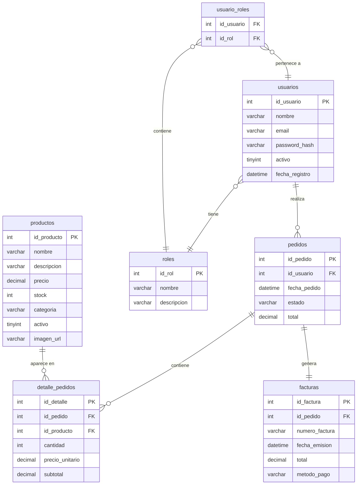

# Diagrama Entidad-Relacion (DER)

> Diagrama generado con Mermaid. Se renderiza automaticamente en GitHub.

## Modelo Relacional - `inventario_ventas`

## Diccionario de Datos

### usuarios
| Columna | Tipo | Descripcion |
|---------|------|-------------|
| id_usuario | INT (PK) | Identificador unico |
| nombre | VARCHAR(100) | Nombre completo |
| email | VARCHAR(100) | Correo electronico (login) |
| password_hash | VARCHAR(255) | Hash BCrypt |
| activo | TINYINT(1) | Estado del usuario |
| fecha_registro | DATETIME | Fecha de creacion |

### roles
| Columna | Tipo | Descripcion |
|---------|------|-------------|
| id_rol | INT (PK) | Identificador unico |
| nombre | VARCHAR(50) | ADMINISTRADOR o CLIENTE |
| descripcion | VARCHAR(255) | Descripcion del rol |

### usuario_roles
| Columna | Tipo | Descripcion |
|---------|------|-------------|
| id_usuario | INT (FK) | Referencia a usuarios |
| id_rol | INT (FK) | Referencia a roles |

### productos
| Columna | Tipo | Descripcion |
|---------|------|-------------|
| id_producto | INT (PK) | Identificador unico |
| nombre | VARCHAR(150) | Nombre del producto |
| descripcion | TEXT | Descripcion detallada |
| precio | DECIMAL(10,2) | Precio unitario |
| stock | INT | Cantidad disponible |
| categoria | VARCHAR(50) | Categoria (texto directo) |
| activo | TINYINT(1) | Visible en catalogo |
| imagen_url | VARCHAR(255) | URL de imagen (placeholder) |

### pedidos
| Columna | Tipo | Descripcion |
|---------|------|-------------|
| id_pedido | INT (PK) | Identificador unico |
| id_usuario | INT (FK) | Cliente que realiza el pedido |
| fecha_pedido | DATETIME | Fecha de creacion |
| estado | VARCHAR(20) | PENDIENTE, CONFIRMADO, ENVIADO, ENTREGADO, CANCELADO |
| total | DECIMAL(10,2) | Monto total |

### detalle_pedidos
| Columna | Tipo | Descripcion |
|---------|------|-------------|
| id_detalle | INT (PK) | Identificador unico |
| id_pedido | INT (FK) | Pedido al que pertenece |
| id_producto | INT (FK) | Producto comprado |
| cantidad | INT | Unidades compradas |
| precio_unitario | DECIMAL(10,2) | Precio al momento de la compra |
| subtotal | DECIMAL(10,2) | cantidad * precio_unitario |

### facturas
| Columna | Tipo | Descripcion |
|---------|------|-------------|
| id_factura | INT (PK) | Identificador unico |
| id_pedido | INT (FK) | Pedido asociado (1 a 1) |
| numero_factura | VARCHAR(20) | FAC-00001 (generado) |
| fecha_emision | DATETIME | Fecha de generacion |
| total | DECIMAL(10,2) | Total de la factura |
| metodo_pago | VARCHAR(50) | EFECTIVO (default) |

## Tipos de Relaciones

| Tabla A | Cardinalidad | Tabla B | Explicacion |
|---------|:-----------:|---------|-------------|
| usuarios | M : M | roles | Un usuario puede tener varios roles y viceversa (tabla puente `usuario_roles`) |
| usuarios | 1 : M | pedidos | Un usuario (cliente) puede tener muchos pedidos |
| pedidos | 1 : M | detalle_pedidos | Un pedido contiene varios items |
| productos | 1 : M | detalle_pedidos | Un producto aparece en varios detalles |
| pedidos | 1 : 1 | facturas | Cada pedido genera exactamente una factura |

## Normalizacion

La base de datos cumple con **3FN (Tercera Forma Normal)**:

- **1FN**: Todos los atributos son atomicos (no hay grupos repetitivos)
- **2FN**: No hay dependencias parciales (tablas con PK compuesta tienen sentido)
- **3FN**: No hay dependencias transitivas (categoria en productos es directa, no deriva de otra columna)
