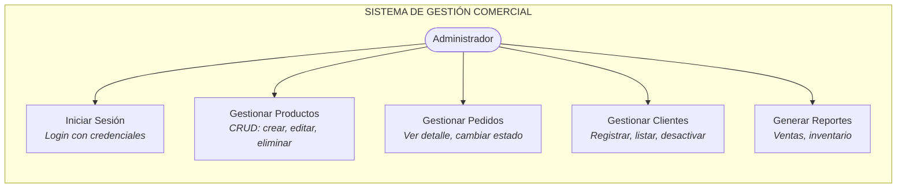
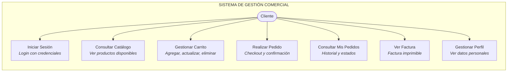

# Diagramas de Casos de Uso

> Los diagramas están renderizados con [Mermaid](https://mermaid.js.org/). Se visualizan automáticamente en GitHub y en editores compatibles.

---

## Actor: Administrador

---

## Actor: Cliente

---

## Descripción de Casos de Uso

### CU-01: Iniciar Sesión
| Campo | Detalle |
|-------|---------|
| **Actor** | Administrador, Cliente |
| **Descripción** | El usuario ingresa email y contraseña para acceder al sistema. Spring Security valida las credenciales con BCrypt y redirige según el rol. |
| **Flujo Principal** | 1. Ingresa email y contraseña → 2. Sistema valida → 3. Redirige a `/dashboard` (admin) o `/cliente/dashboard` (cliente) |
| **Flujo Alternativo** | Credenciales incorrectas → mensaje de error en `/login?error` |

### CU-02: Gestionar Productos (Admin)
| Campo | Detalle |
|-------|---------|
| **Actor** | Administrador |
| **Descripción** | CRUD completo de productos: nombre, descripción, precio, stock, categoría, estado activo/inactivo. |
| **Flujo Principal** | 1. Accede a `/productos` → 2. Lista todos los productos → 3. Crea/edita/elimina |

### CU-03: Gestionar Carrito (Cliente)
| Campo | Detalle |
|-------|---------|
| **Actor** | Cliente |
| **Descripción** | Agrega productos al carrito (sesión HTTP), actualiza cantidades o elimina items. |
| **Flujo Principal** | 1. Navega el catálogo → 2. Agrega al carrito → 3. Ajusta cantidades → 4. Procede al checkout |

### CU-04: Realizar Pedido (Cliente)
| Campo | Detalle |
|-------|---------|
| **Actor** | Cliente |
| **Descripción** | Confirma el carrito, el sistema crea el pedido con estado PENDIENTE, descuenta stock y genera factura automática. |
| **Flujo Principal** | 1. POST a `/cliente/checkout` → 2. Crea `Pedido` + `DetallePedido` → 3. Descuenta stock → 4. Genera `Factura` → 5. Redirige a `/cliente/pedidos` |
| **Precondición** | Carrito no vacío, stock suficiente |

### CU-05: Gestionar Pedidos (Admin)
| Campo | Detalle |
|-------|---------|
| **Actor** | Administrador |
| **Descripción** | Visualiza todos los pedidos ordenados por fecha y cambia su estado. |
| **Flujo Principal** | 1. Lista en `/admin/pedidos` → 2. Ve detalle → 3. Cambia estado (PENDIENTE → CONFIRMADO → ENVIADO → ENTREGADO / CANCELADO) |

### CU-06: Ver Factura
| Campo | Detalle |
|-------|---------|
| **Actor** | Cliente |
| **Descripción** | Visualiza la factura generada automáticamente al crear el pedido, con opción de impresión. |
| **Flujo Principal** | 1. Desde detalle del pedido → 2. Enlace "Ver Factura" → 3. Factura con datos del cliente, productos, total y número FAC-XXXXX |
| **Postcondición** | La factura se genera automáticamente en el checkout |

---

## Matriz Actor vs Caso de Uso

| Caso de Uso | Administrador | Cliente | Sistema |
|-------------|:---:|:---:|:---:|
| Iniciar Sesión | ✅ | ✅ | |
| Gestionar Productos | ✅ | | |
| Gestionar Pedidos | ✅ | | |
| Gestionar Clientes | ✅ | | |
| Generar Reportes | 🔄 | | |
| Consultar Catálogo | | ✅ | |
| Gestionar Carrito | | ✅ | |
| Realizar Pedido | | ✅ | |
| Consultar Pedidos | ✅ | ✅ | |
| Ver Factura | | ✅ | |
| Generar Factura | | | ✅ |
