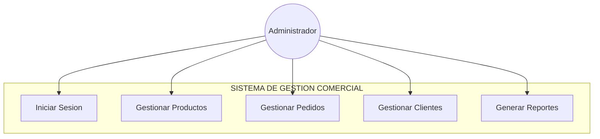
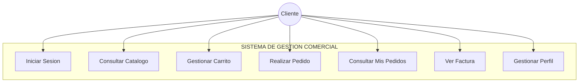

# Diagramas de Casos de Uso

## Administrador

## Cliente

## Descripcion de Casos de Uso

### CU-01: Iniciar Sesion
- **Actores**: Administrador, Cliente
- **Descripcion**: El usuario ingresa email y contrasena. Spring Security valida con BCrypt y redirige segun el rol.
- **Flujo**: Login --> Validacion --> `/dashboard` (admin) o `/cliente/dashboard` (cliente)

### CU-02: Gestionar Productos (Admin)
- **Actor**: Administrador
- **Descripcion**: CRUD completo en `/productos`: crear, editar, eliminar, listar productos con nombre, precio, stock y categoria.
- **Flujo**: Listar --> Nuevo/Editar --> Guardar --> Redireccion

### CU-03: Gestionar Carrito (Cliente)
- **Actor**: Cliente
- **Descripcion**: Agrega productos al carrito (sesion HTTP), actualiza cantidades o elimina items desde el catalogo.
- **Flujo**: Catalogo --> Agregar --> Actualizar/Eliminar --> Checkout

### CU-04: Realizar Pedido (Cliente)
- **Actor**: Cliente
- **Descripcion**: Confirma el carrito. El sistema crea el Pedido con estado PENDIENTE, descuenta stock y genera Factura.
- **Flujo**: Checkout --> Crear Pedido --> Descontar Stock --> Generar Factura

### CU-05: Gestionar Pedidos (Admin)
- **Actor**: Administrador
- **Descripcion**: Visualiza todos los pedidos en `/admin/pedidos` y cambia su estado.
- **Flujo**: Listar --> Detalle --> Cambiar Estado (PENDIENTE/CONFIRMADO/ENVIADO/ENTREGADO/CANCELADO)

### CU-06: Ver Factura
- **Actor**: Cliente
- **Descripcion**: Visualiza la factura generada automaticamente al crear el pedido, con opcion de impresion.
- **Flujo**: Detalle del pedido --> Ver Factura --> Factura imprimible

## Matriz Actor vs Caso de Uso

| Caso de Uso | Administrador | Cliente | Sistema |
|-------------|:---:|:---:|:---:|
| Iniciar Sesion | X | X | |
| Gestionar Productos | X | | |
| Gestionar Pedidos | X | | |
| Consultar Catalogo | | X | |
| Gestionar Carrito | | X | |
| Realizar Pedido | | X | |
| Consultar Mis Pedidos | X | X | |
| Ver Factura | | X | |
| Generar Factura | | | X |
