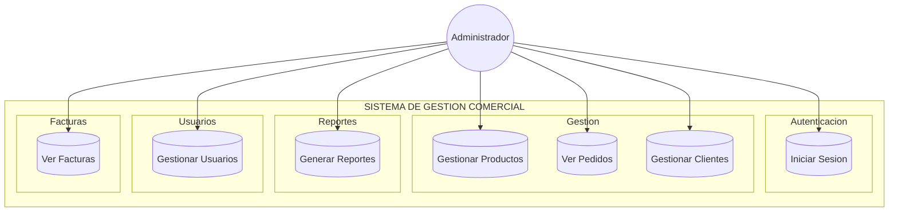
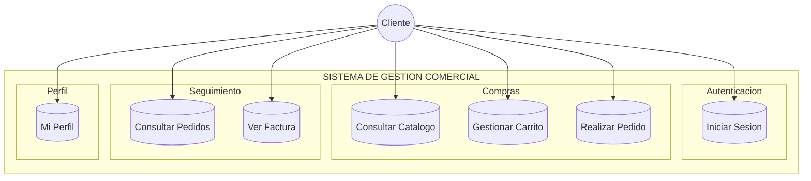

# Diagramas de Casos de Uso

## Administrador



## Cliente



## Casos de Uso Detallados

### CU-01: Iniciar Sesion
```
Actor:      Administrador, Cliente
Precond:    Usuario no autenticado
Flujo:      Ingresa email + password
            Sistema valida con BCrypt
            Redirige segun rol:
              Admin  -> /dashboard
              Cliente -> /cliente/dashboard
Postcond:   Sesion iniciada
```

### CU-02: Gestionar Productos (Administrador)
```
Actor:      Administrador
Rutas:      GET/POST /productos
Acciones:   Listar productos
            Crear nuevo (nombre, precio, stock, categoria)
            Editar existente
            Eliminar producto
Postcond:   BD actualizada
```

### CU-03: Gestionar Carrito (Cliente)
```
Actor:      Cliente
Rutas:      POST /cliente/carrito/agregar
            POST /cliente/carrito/actualizar
            POST /cliente/carrito/eliminar
Almacen:    Sesion HTTP (carrito)
Acciones:   Agregar producto con cantidad
            Actualizar cantidad
            Eliminar item
```

### CU-04: Realizar Pedido (Cliente)
```
Actor:      Cliente
Ruta:       POST /cliente/checkout
Precond:    Carrito no vacio, stock suficiente
Flujo:      Validar stock de cada producto
            Crear Pedido (estado ENVIADO)
            Descontar stock de productos
            Generar Factura (FAC-XXXXX)
            Vaciar carrito
Postcond:   Pedido + Factura creados
```

### CU-05: Ver Pedidos (Administrador)
```
Actor:      Administrador
Rutas:      GET /admin/pedidos
            GET /admin/pedidos/{id}
Estados:    ENVIADO (creado automaticamente al comprar)
            ENTREGADO
            CANCELADO
Acciones:   Ver lista de todos los pedidos
            Ver detalle del pedido
            El estado se asigna automaticamente (ENVIADO al crear)
```

### CU-06: Ver Factura
```
Actor:      Cliente
Ruta:       GET /cliente/factura/{id}
Generacion: Automatica al crear pedido
Formato:    Vista imprimible
Datos:      Numero FAC-XXXXX
            Datos del cliente
            Detalle de productos
            Total
```

### CU-07: Gestionar Usuarios (Administrador)
```
Actor:      Administrador
Rutas:      GET /admin/usuarios
            GET /admin/usuarios/nuevo
            POST /admin/usuarios/guardar
Acciones:   Ver listado de usuarios del sistema
            Crear nuevo usuario con rol seleccionable (Cliente o Administrador)
            El registro publico (/registro) solo crea Clientes
```

### CU-08: Ver Facturas (Administrador)
```
Actor:      Administrador
Rutas:      GET /admin/facturas
            GET /admin/facturas/{id}
Acciones:   Ver listado de todas las facturas emitidas
            Ver detalle de factura (cliente, productos, total)
```

### CU-09: Generar Reportes (Administrador)
```
Actor:      Administrador
Ruta:       GET /admin/reportes
Datos:      Total pedidos
            Enviados / Entregados / Cancelados
            Productos con stock bajo (<=5)
            Total productos en inventario
```

## Matriz de Relacion

| Funcionalidad | Admin | Cliente | Sistema |
|---------------|:-----:|:-------:|:-------:|
| Login | X | X | |
| CRUD Productos | X | | |
| Ver Pedidos | X | X | |
| Gestionar Usuarios | X | | |
| Consultar Catalogo | | X | |
| Carrito de Compras | | X | |
| Realizar Pedido | | X | |
| Ver Factura | X | X | |
| Generar Factura | | | X |
| Generar Reportes | X | | |
| Gestionar Clientes | X | | |
| Mi Perfil | | X | |
