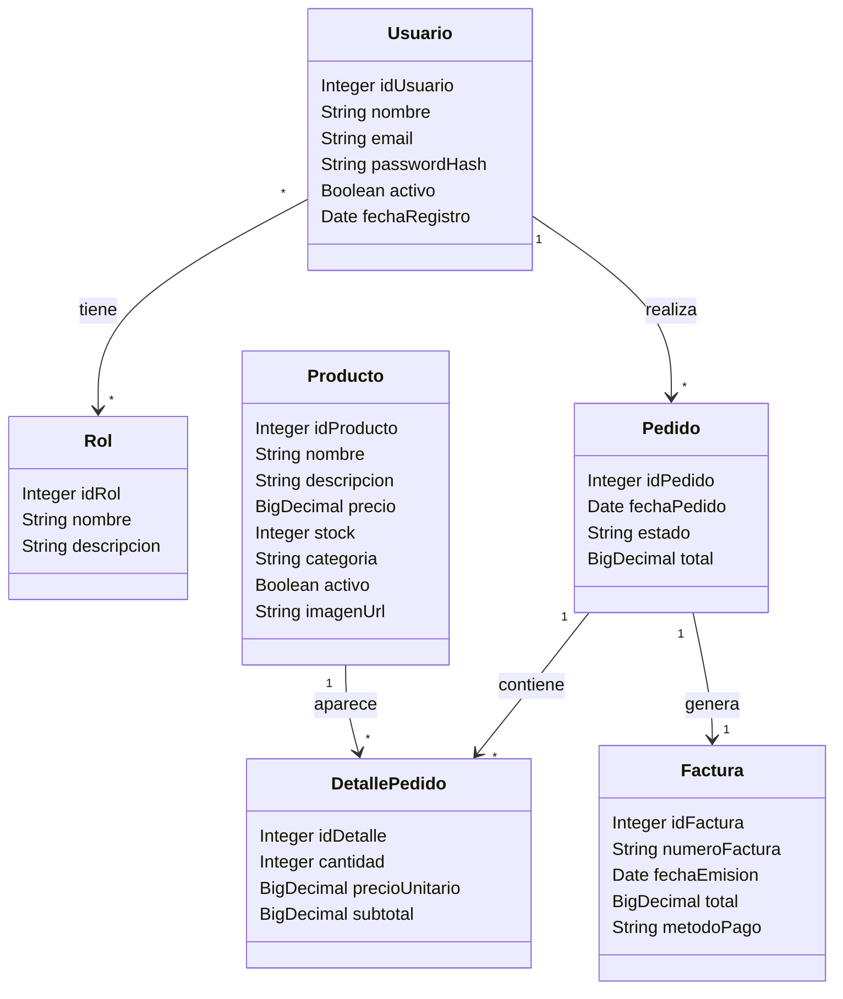

# Diagrama de Clases

## Entidades del Modelo



## Relaciones

| Entidad A | Relación | Entidad B |
|-----------|----------|-----------|
| Usuario | * ― * | Rol |
| Usuario | 1 ― * | Pedido |
| Pedido | 1 ― * | DetallePedido |
| Producto | 1 ― * | DetallePedido |
| Pedido | 1 ― 1 | Factura |

## Arquitectura General

```
┌─────────────────────────────────────────────────┐
│                   VISTAS                         │
│          (Thymeleaf Templates)                   │
│  login │ registro │ dashboard │ productos       │
│  carrito │ pedidos │ factura │ perfil           │
└──────────────────┬──────────────────────────────┘
                   │
┌──────────────────▼──────────────────────────────┐
│               CONTROLADORES                      │
│  AuthController │ ProductoController             │
│  ClienteController │ PedidoAdminController       │
└──────────────────┬──────────────────────────────┘
                   │
┌──────────────────▼──────────────────────────────┐
│                SERVICIOS                         │
│  UsuarioService │ CustomUserDetailsService       │
└──────────────────┬──────────────────────────────┘
                   │
┌──────────────────▼──────────────────────────────┐
│              REPOSITORIOS JPA                    │
│  UsuarioRepository │ ProductoRepository          │
│  PedidoRepository │ FacturaRepository            │
└─────────────────────────────────────────────────┘
                   │
                   ▼
           ┌─────────────┐
           │   MySQL DB  │
           └─────────────┘
```
