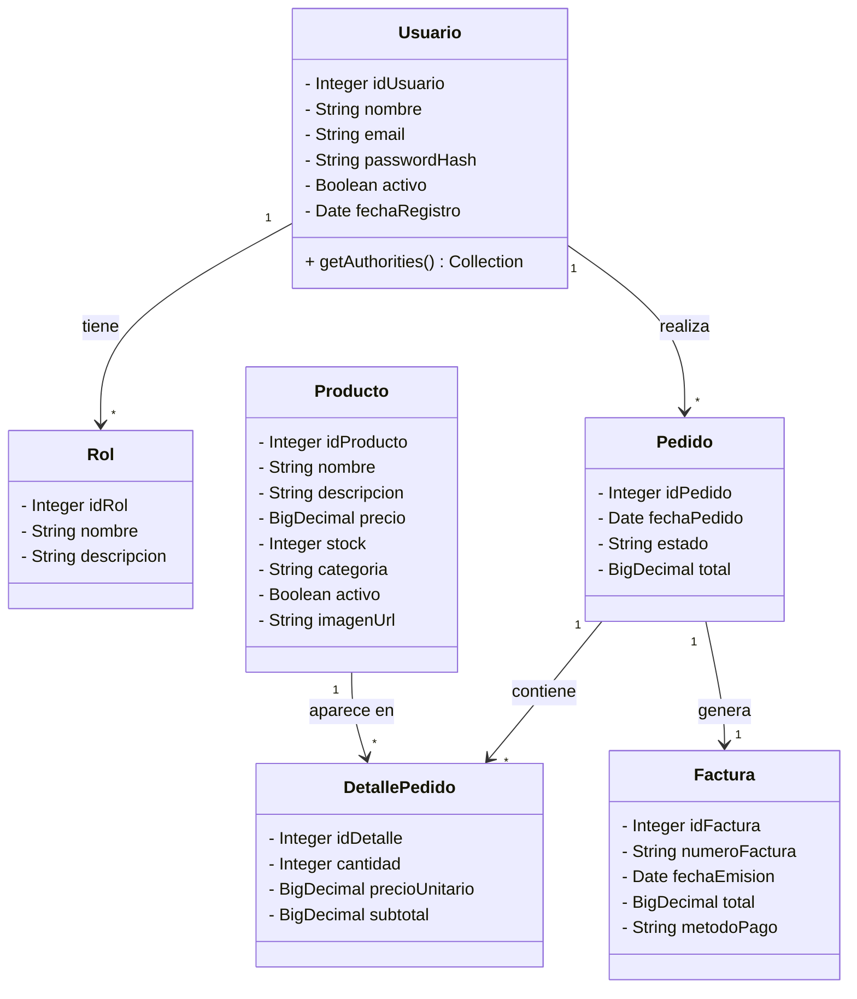
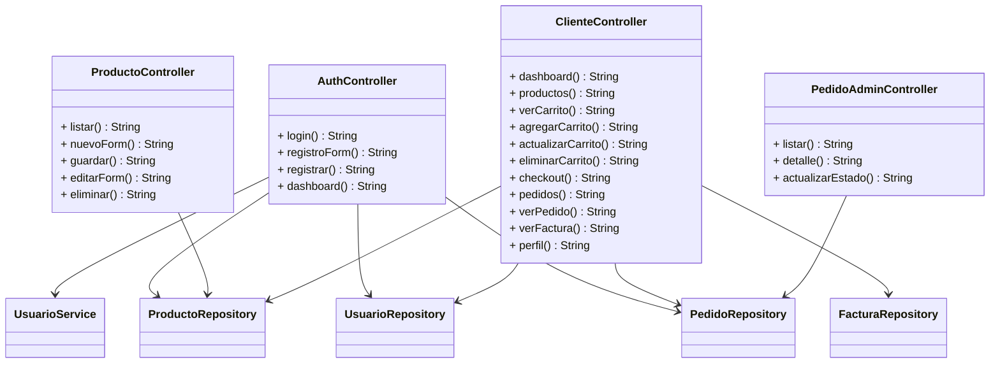
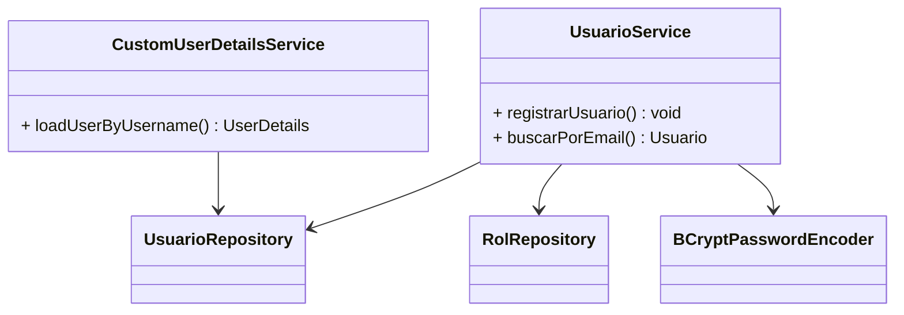

# Diagrama de Clases

> Los diagramas están renderizados con [Mermaid](https://mermaid.js.org/). Se visualizan automáticamente en GitHub y en editores compatibles.

## Modelo del Dominio (Entidades JPA)



## Capa de Control (Controladores Spring MVC)



## Capa de Servicios



## Capa de Acceso a Datos (Repositorios)

```mermaid
classDiagram
    class UsuarioRepository {
        <<JpaRepository>>
        + findByEmail() Optional~Usuario~
        + existsByEmail() boolean
        + countByRolesNombre() long
    }

    class RolRepository {
        <<JpaRepository>>
        + findByNombre() Optional~Rol~
    }

    class ProductoRepository {
        <<JpaRepository>>
        + findByActivoTrue() List~Producto~
        + findByCategoriaAndActivoTrue() List~Producto~
        + findAllByOrderByNombreAsc() List~Producto~
    }

    class PedidoRepository {
        <<JpaRepository>>
        + findByUsuarioOrderByFechaPedidoDesc() List~Pedido~
        + findAllByOrderByFechaPedidoDesc() List~Pedido~
    }

    class FacturaRepository {
        <<JpaRepository>>
        + findByPedido() Optional~Factura~
        + existsByPedido() boolean
    }

    class DetallePedidoRepository {
        <<JpaRepository>>
    }
```



## Vistas (Thymeleaf)

```
├── login.html              # Inicio de sesión
├── registro.html           # Registro de usuarios
├── dashboard.html          # Dashboard administrador
├── admin/
│   ├── pedidos.html        # Lista de pedidos (admin)
│   └── pedido-detalle.html # Detalle + cambio de estado
├── productos/
│   ├── listar.html         # CRUD productos
│   └── form.html           # Crear/editar producto
├── cliente/
│   ├── dashboard.html      # Dashboard cliente
│   ├── productos.html      # Catálogo de productos
│   ├── carrito.html        # Carrito de compras
│   ├── pedidos.html        # Mis pedidos
│   ├── pedido-detalle.html # Detalle del pedido
│   ├── factura.html        # Factura imprimible
│   └── perfil.html         # Perfil de usuario
```

## Relaciones entre Entidades

| Entidad A | Relación | Entidad B | Tipo |
|-----------|----------|-----------|------|
| Usuario | 1 ― * | Rol | ManyToMany |
| Usuario | 1 ― * | Pedido | OneToMany |
| Pedido | 1 ― * | DetallePedido | OneToMany (cascada) |
| Producto | 1 ― * | DetallePedido | OneToMany |
| Pedido | 1 ― 1 | Factura | OneToOne |

## Patrón Arquitectónico

**Spring MVC (Modelo-Vista-Controlador)** con capas adicionales:

- **Modelo**: Entidades JPA (`@Entity`) en `model/`
- **Repositorio**: Interfaces Spring Data JPA en `repository/`
- **Servicio**: Lógica de negocio (`@Service`) en `service/`
- **Controlador**: Manejadores de peticiones (`@Controller`) en `controller/`
- **Vista**: Plantillas Thymeleaf en `templates/`
