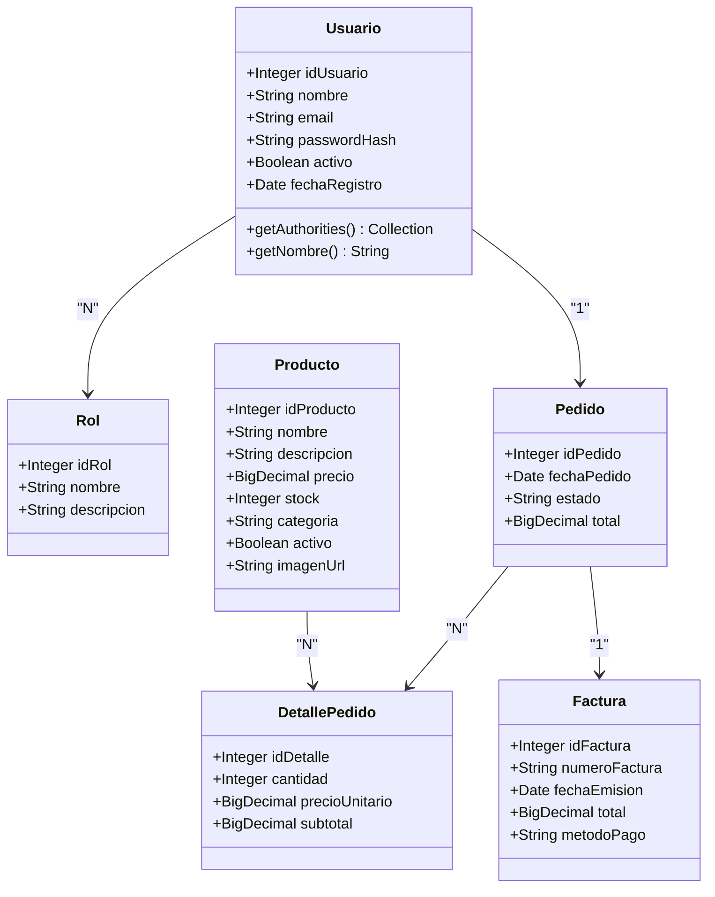
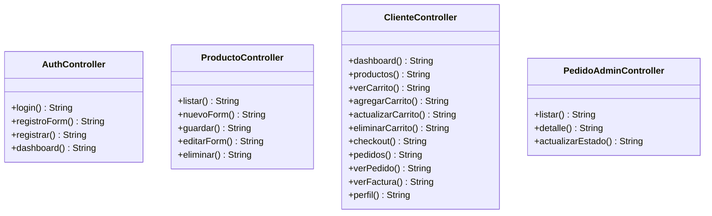
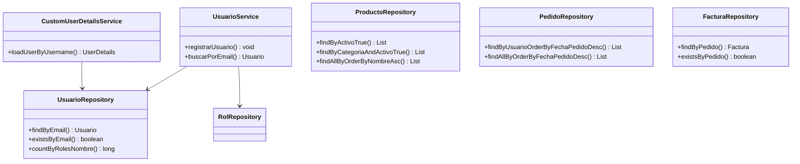
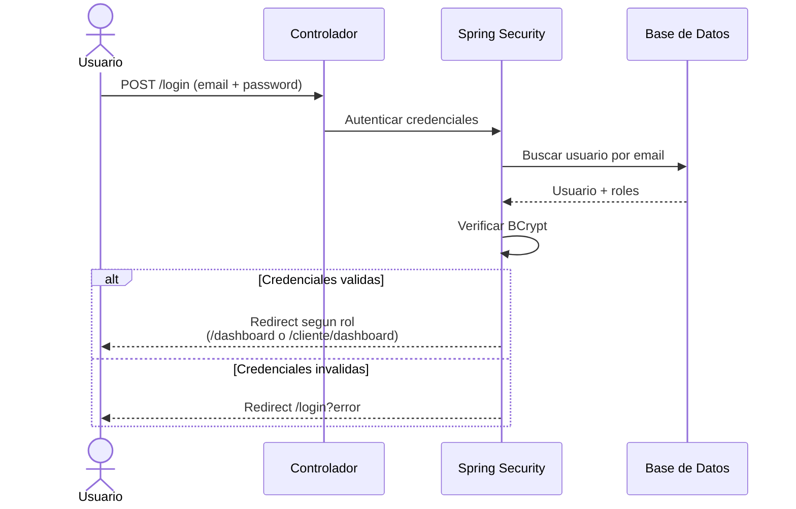
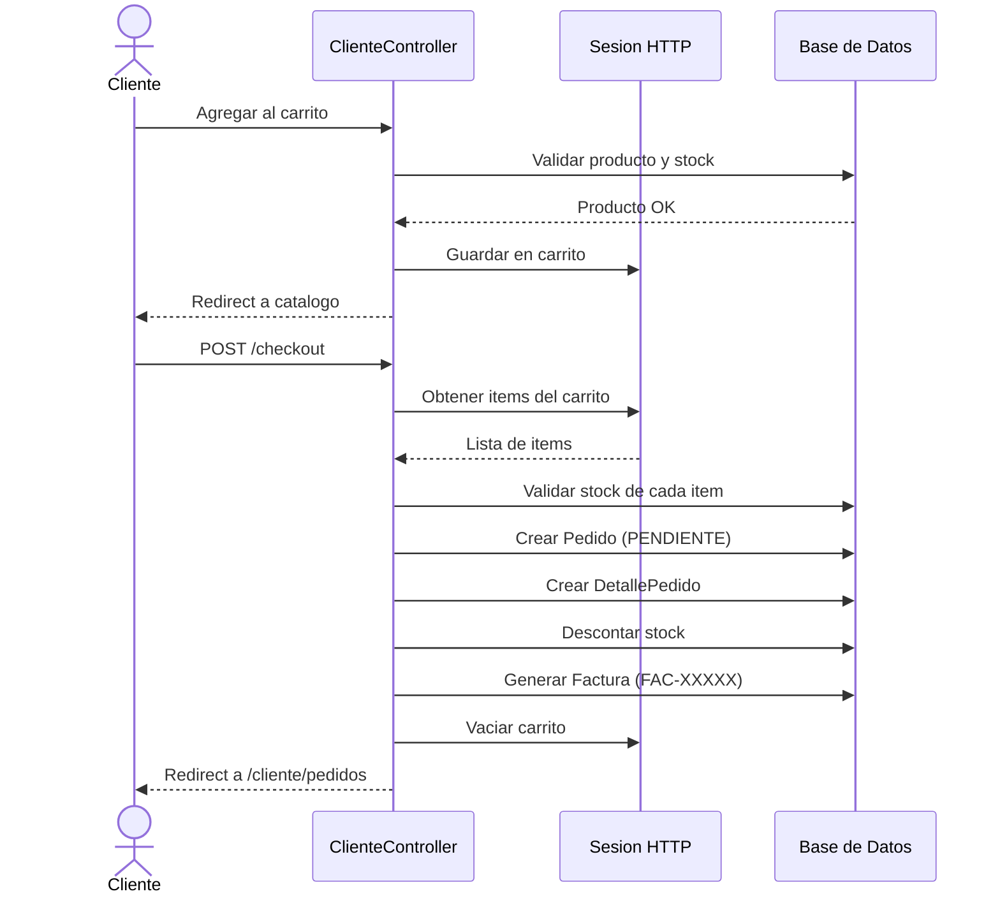
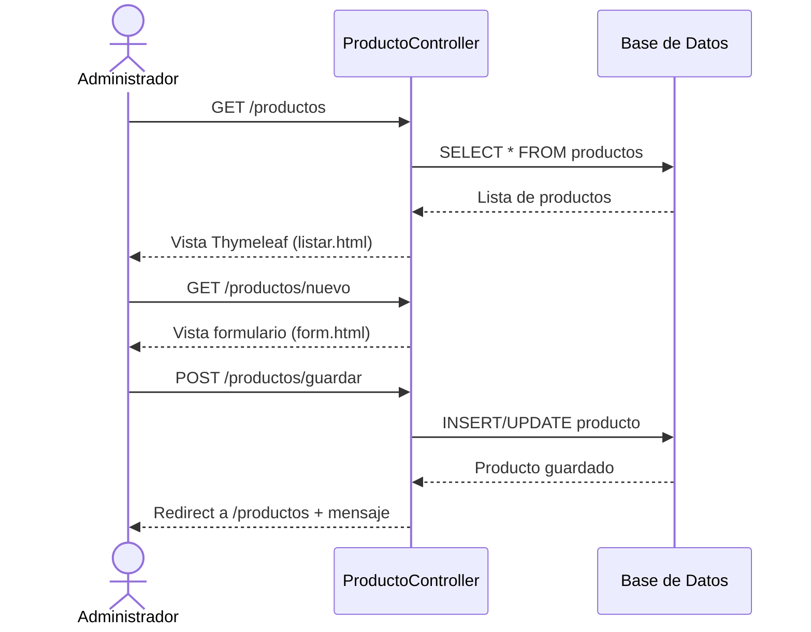
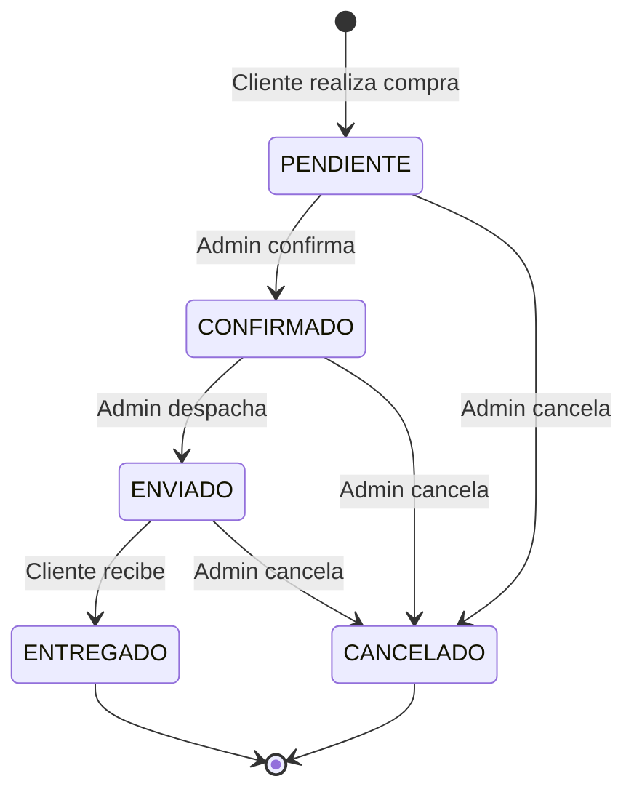

# Diagrama de Clases

## Modelo de Datos (Entidades JPA)

## Capas de la Aplicacion

### Controladores

### Servicios y Repositorios

## Relaciones entre Entidades

| Tabla | Relacion | Tabla | Tipo |
|-------|----------|-------|------|
| usuarios | M ― M | roles | `usuario_roles` |
| usuarios | 1 ― M | pedidos | Un cliente tiene muchos pedidos |
| pedidos | 1 ― M | detalle_pedidos | Un pedido contiene varios items |
| productos | 1 ― M | detalle_pedidos | Un producto aparece en varios detalles |
| pedidos | 1 ― 1 | facturas | Cada pedido genera una factura |

## Flujo de la Aplicacion

### Inicio de Sesion

### Compra (Carrito + Checkout)

### Gestion de Productos (Admin)

### Ciclo de Vida del Pedido (Admin)

